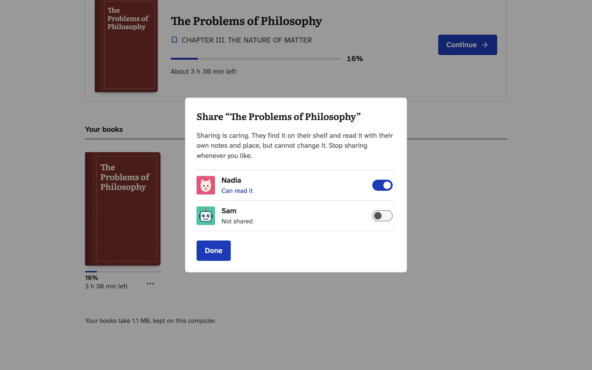
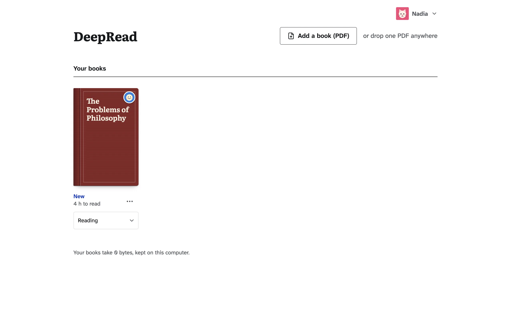
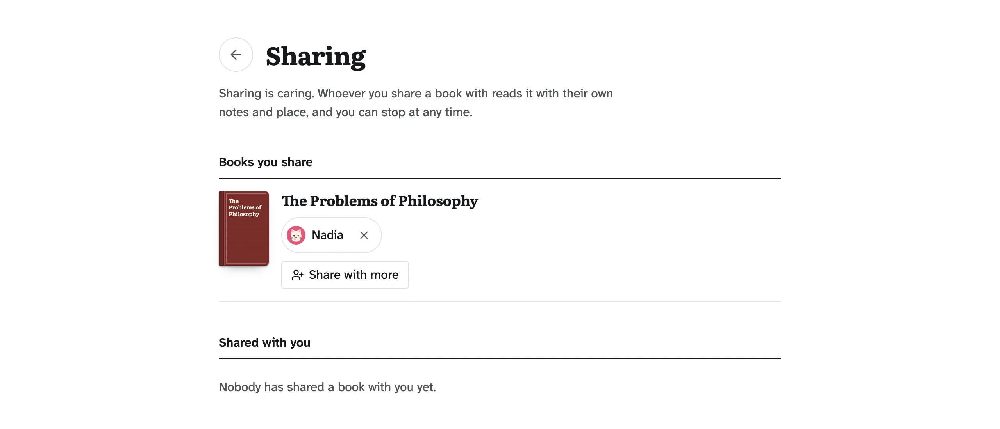
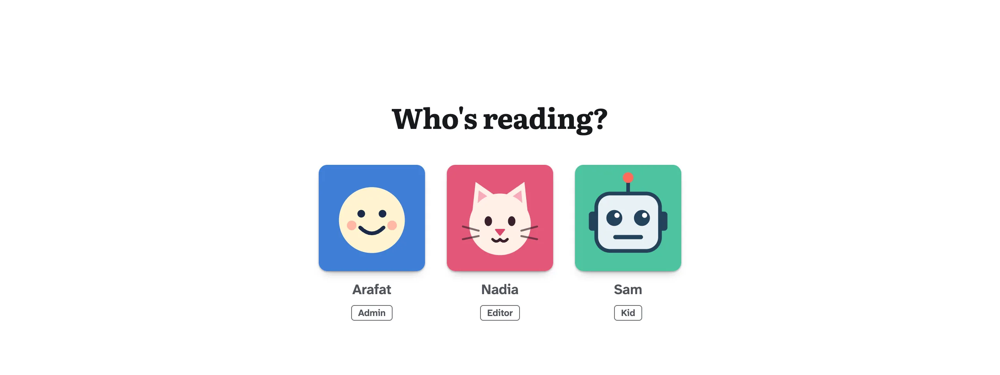
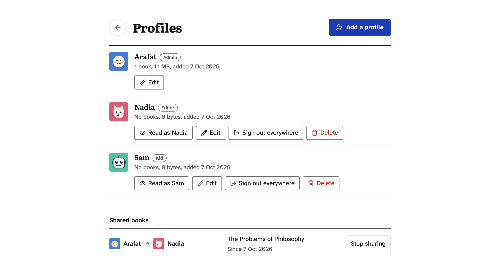
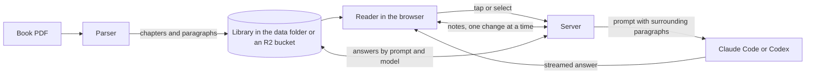

<div align="center">

# DeepRead

**Your own reading library for hard books in English, with an AI tutor beside every page.**

Tap a word for its meaning in your own language.
Select a passage and get it explained in simple words.
Listen to the book read aloud, in a natural voice if you like.
Come back to the exact line you left, on any device.
Share a book with the people you read with, and each of you keeps your own place and notes.
Your books stay on your computer, and AI help uses your own Claude Code or Codex sign-in.

[](LICENSE)
[](https://nodejs.org)
[-1d3bb8)](#install-in-one-line)

[Install](#install-in-one-line) · [AI helpers](#ai-helpers) · [How to use it](#how-to-use-deepread) · [Read together](#read-together-profiles-and-sharing) · [Troubleshooting](#troubleshooting) · [How it works](#how-it-works)

<table><tr><td></td></tr></table>

</div>

## Why

Reading a difficult book in a second language usually goes like this.
You hit a sentence you do not understand.
You copy it, switch to a chat window, and ask for an explanation.
A word in the answer is hard too, so you ask for a translation.
By the time you come back, you have lost your place and your focus.

DeepRead keeps all of that inside the book.
The explanation appears beside the paragraph you are reading, and you keep going.

## What you can do

| You want to | DeepRead gives you |
| --- | --- |
| Know a word | A card in your language with a simple English meaning and an example, chosen for the sentence you are in ([Tap a word](#4-tap-a-word)) |
| Understand a passage | The passage in simple words, in context, with its deeper meaning and hard words, pinned beside the paragraph like a teacher's note ([Explain a passage](#5-explain-a-passage)) |
| Listen instead of read | The book read aloud with the sentence and word marked, in your browser's voice or an optional natural voice that works offline ([Listen](#7-listen), [A more natural voice](#8-a-more-natural-voice)) |
| Never lose your place | Every book opens on the line you stopped at, on any device, and the shelf shows how far you are ([Your library](#2-your-library)) |
| Read with other people | A profile for each reader, and books you can share with them, read only, each with their own place and notes ([Read together](#read-together-profiles-and-sharing)) |
| Read the way you like | Light, sepia or dark, two fonts, text size, margins, and scrolling or pages ([Make it yours](#10-make-it-yours)) |
| Keep it your own | Your books on your computer or in your own Cloudflare R2 bucket, and AI help through your own Claude Code or Codex sign-in ([AI helpers](#ai-helpers), [Cloudflare R2](#keep-your-books-in-cloudflare-r2)) |

It suits one person on one computer.
If a family, a class or a book club reads on the same DeepRead, turn on profiles: everyone gets a library of their own, and anyone can share a book with the others.

## Install in one line

You do not need to install anything first.

1. Open the Terminal app.
   On a Mac, press Command and Space together, type `Terminal`, and press Return.
   On Windows, open **On Windows** just below and follow it instead.
2. Copy this line, paste it into the Terminal window, and press Return:

   ```bash
   curl -fsSL https://raw.githubusercontent.com/mrx-arafat/DeepRead/main/scripts/install.sh | bash
   ```

3. If it asks you something, press Return to accept the suggested answer.
4. When it says DeepRead is ready, press Return to start it.
   DeepRead opens in your web browser.

That is the whole installation, and it takes a minute or two.
It asks before it installs anything optional, and your books stay on your computer.

<table>
<tr><td width="34%"><b>What it checks</b></td><td width="66%"><b>What it does about it</b></td></tr>
<tr><td>git</td><td>Tells you the one command to install it if it is missing.</td></tr>
<tr><td>Node.js 24 or newer, the engine DeepRead runs on</td><td>Uses one already on your computer, even if your terminal normally runs an older one (from Homebrew, nvm, fnm, Volta, asdf or mise). If there is none, it downloads a private copy from <a href="https://nodejs.org">nodejs.org</a> just for DeepRead, checks that the download is genuine, and changes nothing else on your computer.</td></tr>
<tr><td>An AI helper</td><td>Looks for Claude Code or Codex, including where their installers put them when your terminal cannot see them yet. If neither is there, it lets you pick one to install, or none (the default): reading and listening work without one (see <a href="#ai-helpers">AI helpers</a>). Nothing is installed unless you pick it.</td></tr>
<tr><td>DeepRead itself</td><td>Downloads it to <code>~/DeepRead</code> (or updates it), installs its packages, builds it, and adds the <code>deepread</code> command.</td></tr>
</table>

### Start, stop, update

| To | Do this |
| --- | --- |
| Start DeepRead | Open Terminal, type `deepread`, and press Return. It opens http://127.0.0.1:8787 in your browser. |
| Stop it | Press `Control` and `C` together in the Terminal window where it runs. |
| Get the latest version | Type `deepread update` and press Return, or paste the install line again. |
| See every option | Type `deepread help` and press Return. |

If Terminal says `deepread: command not found` right after installing, close the Terminal window, open a new one, and try again.
Or type the full path instead, which always works: `~/.local/bin/deepread`

<details>
<summary><b>On Windows</b></summary>

DeepRead runs on Windows inside WSL, Microsoft's built-in Linux.

1. Open PowerShell as administrator and run `wsl --install`.
   Restart your computer when it asks.
2. Open **Ubuntu** from the Start menu and choose a user name and password.
3. In Ubuntu, paste the install line above and press Return.
4. Type `deepread` and press Return.
   It opens DeepRead in your normal Windows browser.

</details>

<details>
<summary><b>Install somewhere else, or uninstall</b></summary>

To install into another folder, put `DEEPREAD_DIR` in front of the command:

```bash
curl -fsSL https://raw.githubusercontent.com/mrx-arafat/DeepRead/main/scripts/install.sh | DEEPREAD_DIR=~/Apps/DeepRead bash
```

To uninstall, delete the folder, the command, and the private Node.js copy if the installer made one:

```bash
rm -rf ~/DeepRead ~/.local/bin/deepread ~/.local/share/deepread
```

This also deletes your books and notes, which live in `~/DeepRead/data` unless you keep them in Cloudflare R2.
Books and notes kept in R2 stay in your bucket, so this does not remove them (see [Keep your books in Cloudflare R2](#keep-your-books-in-cloudflare-r2)).
The installer may have added a line mentioning `.local/bin` to `~/.zshrc`, `~/.bashrc` or `~/.bash_profile`; you can delete it too.

</details>

## AI helpers

DeepRead has no API key and no account of its own.
It explains words and passages through an AI tool you already use, signed in with your own subscription.

| AI helper | Comes with | Install | Sign in once |
| --- | --- | --- | --- |
| **Claude Code** | Claude Pro or Max | `curl -fsSL https://claude.ai/install.sh \| bash` | run `claude` and follow the steps |
| **Codex** | ChatGPT Plus or Pro | `npm install -g @openai/codex` | run `codex` and choose **Sign in with ChatGPT** |

If you have both, open **Aa** in the reader and pick one under **AI helper**.
With profiles on, only the admin can change it, because it is the same helper for everyone.
DeepRead remembers your choice.
If you install one later, it shows up there the next time you open the menu.

<table><tr><td></td></tr></table>

**With no AI helper at all**, you can still read, listen, change settings, and tap a word to see a quick translation in your language.
Only the explanations (the meaning, the example sentence and the passage notes) need an AI helper, and DeepRead tells you how to add one.

> [!NOTE]
> Antigravity's command-line tool is not supported.
> When asked a question from a script, it runs commands on your computer, even in its plan and sandbox modes, so text inside a book could make it do things you did not ask for.
> Claude Code and Codex are both run with their tools switched off.

## How to use DeepRead

DeepRead opens straight to your library, with no sign-in, unless the person who set it up turned on profiles (see [Read together](#read-together-profiles-and-sharing)).
With profiles on, DeepRead opens on **Who's reading?** first: click your picture, type your code, and you are in your own library for the next 30 days on that browser.
Your books, your place in each book, your notes and your saved answers belong to your profile, and other profiles cannot see them.
The steps below are the same for every profile.

### 1. Add a book

Click **Add a book (PDF)**, or drop a PDF anywhere on the page.
DeepRead works with PDFs whose text you can select (most e-books and Project Gutenberg books).
Scanned books, where each page is a photo, need OCR first.

<table><tr><td></td></tr></table>

### 2. Your library

Your books stand on a shelf with their own covers when the PDF has a cover on its first page.
Otherwise DeepRead makes a cloth cover from the title, and shows it too when a cover image is slow or broken.
The book you read last waits at the top in a **Continue reading** card, with the chapter you stopped in and how much of the book is left.
Click **Continue**, or the card, to open it right there.
Under each cover a thin line shows how far you are, with the time left, or **New** and the time it takes to read for a book you have not opened.

**Where you stopped.**
Click a cover, or the title, to open that book on the very line you stopped at.
DeepRead keeps that place for every book, as you read and again the moment you leave, so the next visit starts there, on any device that opens this DeepRead.
The percentage counts the text above that line over the whole book, by length, so a long paragraph counts for more than a short one.
Contents, notes and index pages do not count.
Jumping ahead from the chapter list moves your place, and the percentage with it: it says where you are in the book, not how much you have read.

**More actions.**
The **...** button under a cover lets you edit the book's title and author, share it with other profiles (see [Share a book](#11-share-a-book)), or remove it.
A book someone shared with you has "From" and their name under it, and only lets you take it off your shelf.

<table><tr><td></td></tr></table>

### 3. Read

The book reads as one long page.
It opens at the book itself, past the title page and contents, and the next chapter follows as you scroll.
Scroll up from the start of a chapter and the one before it comes in above, without moving the text you are on, so you can re-read how the last chapter ended.
Your place is saved as you go.

<table><tr><td></td></tr></table>

### 4. Tap a word

Tap or click any word.
A card shows its meaning in your language, a simple English meaning, and an everyday example.
The meaning is chosen for the sentence you are in, so "minute sums of money" is "very small", not a unit of time.
Terms like "sense-data" and "a priori" are looked up whole.
The speaker button says the word aloud.

<table><tr><td></td></tr></table>

On a wide screen the card sits in the margin, level with the word, so it never covers the text.
On a narrow screen it opens above or below, clear of the sentence you are reading.

### 5. Explain a passage

Select a sentence or a paragraph, then choose what you want:

| Button | You get |
| --- | --- |
| **Explain** | The passage in simple words, in context (who is speaking, what just happened), its deeper meaning, and its hard words |
| **Example** | The idea retold as an everyday situation |
| **In Bangla** (named after your language) | A faithful translation into your language, then a short explanation |
| **Listen** | Reading aloud from that passage |

<table><tr><td></td></tr></table>

The answer is pinned beside the paragraph like a teacher's note, and it stays there when you come back to the book.
DeepRead keeps these notes with the book, not in the browser, so clearing your browser does not lose them and they show on your phone too.
Notes that were saved in a browser before are moved up automatically the next time you open that book.
If DeepRead cannot be reached when you make a note, your browser holds it until it can.
Your reading settings under **Aa** are different: they stay in each browser, so a phone has its own.

<table><tr><td></td></tr></table>

### 6. Before and after a chapter

Each chapter starts with a **Before you read** box: **Get a preview** gives a short preview with the words to watch.
It ends with a **What you just read** box: **Get a summary** gives the key ideas in simple words.

### 7. Listen

Press **Listen** in the top bar.
DeepRead reads from the line you are looking at, chapter titles included, and marks the sentence in green and the word being spoken in a stronger green.
The player has previous and next sentence, pause, speed (0.6x to 1.5x) and stop.
If you scroll away, the page stays where you put it, and the player offers a way back to the voice.

<table><tr><td></td></tr></table>

Listening uses the voices built into your browser and computer, so it works without an AI helper.
DeepRead pauses where a person would: a little after each sentence, longer between paragraphs, and longest after a chapter title.

### 8. A more natural voice

By default DeepRead reads with the voice built into your browser and computer.
For a more human one, open the **Aa** menu and choose **Natural** under **Read-aloud voice** (pictured in [AI helpers](#ai-helpers)).
It downloads once (326 MB, with a progress figure in the menu), and from then on it runs on your computer's graphics card and works offline.
It needs a browser with WebGPU, which means a recent Chrome or Edge on a computer from the last few years.
If your browser or computer cannot run it, or runs it too slowly to keep up with the reading, DeepRead says so in the menu and keeps the voice built into your computer.
While it downloads, reading aloud carries on with that voice, and a single word said from its card always uses it.
Choosing **This device** again lets go of the natural voice and its memory.
The code for it (kokoro-js, pinned to one version) comes from jsDelivr and the voice model from Hugging Face, and only that download uses the network.
The book text is never sent anywhere to be read aloud.

### 9. Jump to a chapter

The list button at the top left shows every chapter with its reading time.
Front and back matter (contents, notes, index, licences) are listed but do not count toward your progress.
After a jump, the browser's Back button returns you to the paragraph you were reading, and Forward to where you jumped.

<table><tr><td></td></tr></table>

### 10. Make it yours

Open **Aa** at the top right to set the page the way an e-reader does: a light, sepia or dark theme, the book's font (Literata or Atkinson), text size, line spacing, margins and justified text.
Below those are the read-aloud voice (see [A more natural voice](#8-a-more-natural-voice)), the language explanations come in and your AI helper, all pictured in [AI helpers](#ai-helpers).
The footer under the text tells you how many minutes of the chapter are left, then marks the end of the book when you reach its closing panel.

**Layout** chooses how you move through the book: **Scroll** (the default) reads it as one long page, and **Pages** turns it a page at a time like an e-reader.
In Pages, turn with the on-screen Previous page and Next page buttons, the arrow keys, Page Up and Page Down, Space, a flick of the mouse wheel or trackpad, a swipe, or a click in the margin beside the text.
Every page starts on a whole line and no line is ever cut at the bottom, and each chapter opens on a page of its own.
The top bar slides away while you read: move the pointer to the top of the window or tap the top margin to bring it back.
The footer then counts the pages left in the chapter and shows how far through the book you are.
Tapping a word still looks it up, and read-aloud turns the page as the voice reaches the next one.
Explanation languages: Bangla (the default), Hindi, Urdu, Arabic, Spanish, French, Indonesian and Turkish.

DeepRead also fits a phone screen, here in the dark theme:

<table><tr><td></td></tr></table>

### 11. Share a book

With profiles on (see [Read together](#read-together-profiles-and-sharing)), you can lend a book to the people you read with.
Open the **...** menu under its cover, choose **Share**, and turn on the switch beside each person.

<table><tr><td></td></tr></table>

The book appears on their shelf marked "From" your name, and they read it with their own place, notes and saved answers.
Nothing is copied, and they cannot change it, rename it or pass it on.

<table><tr><td></td></tr></table>

Turn the switch off, or press the cross beside their name on the **Sharing** page, and the book leaves their shelf at once.
What they kept of it waits out of sight, so sharing it again lets them carry on where they were.
The **Sharing** page, in the profile menu, lists the books you share and with whom, and the books shared with you.

<table><tr><td></td></tr></table>

The rules behind sharing are under [Sharing a book](#sharing-a-book).

### 12. By keyboard

| Key | Does |
| --- | --- |
| `Tab` | Moves into the book text |
| `↑` `↓` | Moves between paragraphs |
| `←` `→` | Moves word by word |
| `Enter` | Looks up the word, or opens the Explain bar for the selection |
| `Shift` + `←` `→` | Selects a passage word by word |
| `Esc` | Closes the word card or the Explain bar and returns you to your place; with nothing open, stops listening |

## Troubleshooting

<details>
<summary><b><code>deepread: command not found</code></b></summary>

Open a new terminal window: the installer added the command to your PATH, and only new windows see it.
You can also start DeepRead directly with `node ~/DeepRead/scripts/deepread.mjs`.

</details>

<details>
<summary><b>"DeepRead could not start" or port 8787 is in use</b></summary>

Another program uses that port.
Start DeepRead on another one: `DEEPREAD_PORT=8790 deepread`.

</details>

<details>
<summary><b>Explanations say "not signed in"</b></summary>

Open a terminal and sign in to your AI helper once: run `claude` for Claude Code, or `codex` for Codex.
Then press **Try again** on the card.

</details>

<details>
<summary><b>Explanations say "DeepRead needs an AI helper"</b></summary>

Neither Claude Code nor Codex was found.
Install one as shown in [AI helpers](#ai-helpers), sign in, then open **Aa** in the reader.

</details>

<details>
<summary><b>Adding a book says it is a scan</b></summary>

The pages are pictures, not text.
Find a version of the book whose text you can select, or run it through OCR first (for example with `ocrmypdf`), then add the new PDF.

</details>

<details>
<summary><b>Where are my books and notes?</b></summary>

By default, in `~/DeepRead/data`.
Copy that folder to back them up.
`deepread update` never touches it.
If you chose Cloudflare R2, they are in your bucket instead (see [Keep your books in Cloudflare R2](#keep-your-books-in-cloudflare-r2)).
The `data` folder then holds only a few small things, such as your AI helper choice.
With profiles on, each profile's books are in a folder of their own, under `profiles`.

</details>

<details>
<summary><b>I forgot a profile's code</b></summary>

The admin can set a new one.
Open http://127.0.0.1:8787/admin, sign in with the admin passkey, choose **Edit** on that profile, and type a new code (see [Read together](#read-together-profiles-and-sharing)).
That profile is signed out everywhere, and it opens again with the new code.
DeepRead keeps each code only in a scrambled form, so the old one cannot be read back.

</details>

<details>
<summary><b>I forgot the admin passkey</b></summary>

The admin passkey is the `ADMIN_PASSKEY` line in the `.env` or `.env.local` file in your DeepRead folder.
Open that file in a text editor to read it.
To choose a new one, change that line and restart DeepRead.
Everyone is then signed out and signs in again.
This is the only place the admin's code can be changed: /admin cannot do it.

</details>

<details>
<summary><b>Everyone was signed out</b></summary>

The most likely reason is that the sign-in secret was removed.
It is the file `session-secret` in the `data` folder, and deleting it signs everyone out at once.
Changing `ADMIN_PASSKEY` does the same.

If only one profile was signed out, its code was changed, which signs that profile out everywhere.
A sign-in also ends by itself after 30 days.

Either way, choose your profile and type its code again.

</details>

<details>
<summary><b>A profile's sign-in is locked</b></summary>

After 5 wrong codes in a row, DeepRead locks that profile's sign-in on that device for 5 minutes.
Each further lock on the same device lasts twice as long, up to a day.
Other devices are not locked, so someone guessing on one device cannot lock you out of yours.
Wait, then type the right code.
If the code was forgotten, the admin can set a new one in /admin.
Restarting DeepRead also clears the lock.

</details>

<details>
<summary><b>The natural voice will not turn on</b></summary>

Open **Aa** and read the line under **Read-aloud voice**: it says why.
A message about the graphics card means this browser has no WebGPU, so try a recent Chrome or Edge.
A message about speed means this computer could not make speech as fast as it is read, so DeepRead keeps the voice built into it.
If the download stopped partway, check your connection, then choose **This device** and **Natural** again to start it once more.

</details>

<details>
<summary><b>A shared book is gone from my shelf</b></summary>

Its owner stopped sharing it, removed it, or the profile it came from was deleted.
If the owner shares it again, it comes back with your place and notes as you left them.
If the book or the profile was removed, what you kept of it went with it.

</details>

## Read on your phone

With a developer setup (see [For developers](#for-developers)), run:

```bash
pnpm phone
```

This runs DeepRead and shares it through a [Cloudflare quick tunnel](https://developers.cloudflare.com/cloudflare-one/connections/connect-networks/do-more-with-tunnels/trycloudflare/) (needs `cloudflared`, on macOS `brew install cloudflared`).
It prints a link to open on your phone.
The link carries a secret key, kept in `data/remote-key`, that unlocks DeepRead on that device.
Without the key, the tunnel answers nothing but the empty page shell.
Anyone who has the link can use DeepRead and your AI helper's usage, so do not share it.

## Keep your books in Cloudflare R2

By default your books stay in the `data` folder on your computer.
If you would rather keep them online, DeepRead can keep them in a [Cloudflare R2](https://developers.cloudflare.com/r2/) bucket, which is a storage folder in your own Cloudflare account.
Then your library does not depend on this one computer.
You can also set the most space your books may take, whether they are kept on your computer or in R2.

What goes into the bucket: each book's PDF, its parsed text, its cover, the AI answers saved for it, and your notes.
With profiles on (see [Read together](#read-together-profiles-and-sharing)), the list of profiles and the shares go there too.
A few small things always stay on your computer: your AI helper choice, saved quick word translations, the folder DeepRead keeps for Codex, the phone key, the sign-in secret that profiles use, and a book's file while it is being added.

1. In your Cloudflare account, create an R2 bucket.
2. Still in Cloudflare, open **R2**, then **Manage API tokens**, then **Create API token**.
   Give the token **Object Read & Write** on your bucket.
   Cloudflare then shows an access key id, a secret access key and an endpoint (a web address ending in `r2.cloudflarestorage.com`).
3. Open Terminal and make your settings file from the template that comes with DeepRead:

   ```bash
   cd ~/DeepRead
   cp .env.example .env.local
   ```

   If you installed DeepRead into another folder, use that folder instead of `~/DeepRead`.
4. Open `.env.local` in a text editor (on a Mac, `open -e .env.local` does it) and fill it in.
   It looks like this, with your own values in place of the `<...>` parts:

   ```bash
   DEEPREAD_STORAGE=r2
   DEEPREAD_STORAGE_LIMIT=8GB
   DEEPREAD_R2_ENDPOINT=https://<account_id>.r2.cloudflarestorage.com
   DEEPREAD_R2_BUCKET=<bucket-name>
   DEEPREAD_R2_ACCESS_KEY_ID=<access-key-id>
   DEEPREAD_R2_SECRET_ACCESS_KEY=<secret-access-key>
   DEEPREAD_R2_PREFIX=deepread/
   ```

5. Stop DeepRead (press `Control` and `C` in its Terminal window) and start it again with `deepread`.

What each setting means:

- `DEEPREAD_STORAGE` is `local` (the default, your computer's `data` folder) or `r2`.
- `DEEPREAD_STORAGE_LIMIT` is the most space your books may take, for example `8GB`, `500MB` or `1.5TB`.
  Here 1 GB is 1000 MB.
  Write `GiB` or `MiB` to count in 1024s instead.
  Leave it empty for no limit.
  With profiles on, the limit is shared: every profile's books count toward it together.
- `DEEPREAD_R2_ENDPOINT` is the endpoint Cloudflare showed you.
  If your bucket belongs to a region group such as the EU, use the endpoint that has it, like `https://<account_id>.eu.r2.cloudflarestorage.com`.
- `DEEPREAD_R2_BUCKET` is your bucket's name.
- `DEEPREAD_R2_ACCESS_KEY_ID` and `DEEPREAD_R2_SECRET_ACCESS_KEY` are the two keys Cloudflare showed you.
- `DEEPREAD_R2_PREFIX` is the folder inside the bucket that DeepRead uses, `deepread/` unless you change it.
  The bucket can hold other things too: DeepRead does not list, count or remove anything outside that folder.

DeepRead reads `.env.local` first, then a file called `.env` in the same folder.
A value in `.env.local` wins over `.env`, and a value you already set in Terminal wins over both.
`.env.local` holds your secret key, and Git ignores it.
Do not share it.

When DeepRead starts it checks the bucket.
If a setting is wrong, such as a bad key, a missing bucket or no way to reach Cloudflare, it stops and says what is wrong in a plain sentence.
Otherwise the start-up message says where your books are kept and what the limit is.
Under the shelf, the library shows a quiet line such as "Your books take 1.2 GB, kept in Cloudflare R2." (or "kept on this computer").
It shows what is kept and never how much room the limit leaves.

When adding a book would go past the limit, DeepRead does not add it.
The library says the book could not be added because there is no room, how much your books take of what they may use, and how much the new book needs.
Remove a book to make room.

To go back to your computer, set `DEEPREAD_STORAGE=local` and restart.
Books already in the bucket stay there, and the library shows the books in the place you chose.

### Move the books you already have

If you already have books on your computer, copy them into the bucket once:

1. Stop DeepRead.
2. Check that `.env.local` is filled in with `DEEPREAD_STORAGE=r2`.
3. In Terminal, run:

   ```bash
   cd ~/DeepRead
   pnpm storage:migrate
   ```

   If Terminal does not know `pnpm`, `npm run storage:migrate` does the same.
4. Start DeepRead again.

It copies every book the bucket does not have yet, with its notes and saved AI answers.
With profiles on, it also copies the profiles, each with its books and photo, the books shared between them with what readers kept of them, and the list of profiles last.
If the bucket already has profiles of its own, it copies none from your computer: the two lists are not merged.
It skips books that are already in the bucket, and books that would not fit under your limit.
It never changes or removes anything on your computer, so your `data` folder stays as it was.
Run it only while DeepRead is stopped.

## Read together: profiles and sharing

By default DeepRead has one library and no sign-in.
That suits one person on one computer, and it stays that way until you turn profiles on.
If several people read on the same DeepRead, such as a family, a class or a book club, you can give each of them a profile, like "Who's watching?" on a streaming service.
Everyone picks their own picture, types their own code, and reads in their own library, and anyone can [share a book](#11-share-a-book) with the others.

### Turn profiles on

1. Think of a long passphrase for the admin, such as several unrelated words in a row.
   Anyone who knows it can manage every profile, so keep it to yourself.
2. Open Terminal and make your settings file from the template that comes with DeepRead:

   ```bash
   cd ~/DeepRead
   cp .env.example .env.local
   ```

   Skip this step if you already have a `.env.local` or `.env` file in that folder, for example from the R2 steps above: the copy would replace it.
   If you installed DeepRead into another folder, use that folder instead of `~/DeepRead`.
3. Open the file in a text editor (on a Mac, `open -e .env.local` does it) and add these lines, with your own values in place of the `<...>` parts:

   ```bash
   ADMIN_PASSKEY=<a long passphrase>
   ADMIN_NAME=<your name>
   ```

4. Stop DeepRead (press `Control` and `C` in its Terminal window) and start it again with `deepread`.

`ADMIN_PASSKEY` turns profiles on, and it is also the admin's code.
`ADMIN_NAME` is the name on the admin's profile.
It is optional: when you leave it out, the name is `Admin`.
DeepRead reads these two settings the same way as the R2 ones: `.env.local` first, then `.env`, and a value you already set in Terminal wins over both.

The first time DeepRead starts with profiles on, the books already in your library move into the admin's profile.
Nothing is lost, and the other profiles you add later start empty.

Without `ADMIN_PASSKEY`, DeepRead works exactly as before: one library, no sign-in.

### Who's reading?

With profiles on, DeepRead opens on **Who's reading?**, which shows every profile's picture and name.
Click yours and type its code.
You stay signed in on that browser for 30 days.
To read as someone else, open the profile menu at the top of the library and choose **Switch profile**.
Your own profile, marked with a green check, opens without a code; anyone else's asks for theirs.
**Sign out** in the same menu ends your sign-in on that browser.
Coming back to your own profile after reading as someone else asks for your code again.

<table><tr><td></td></tr></table>

A profile can carry a small badge beside its name, such as **Editor** or **Kid**, which the admin chooses.

### What each profile gets

- Its own library: its own books, reading progress, notes and saved answers.
  Other profiles cannot see them.
- Its own picture: one of the built-in ones, or a photo the admin uploads.
- Its own code, which it types to sign in.
- The books other profiles share with it, to read (see [Sharing a book](#sharing-a-book)).
- The same storage limit as everyone else.
  `DEEPREAD_STORAGE_LIMIT` is shared by all profiles, so the books of every profile count toward it together.
  The line under the shelf shows both numbers, such as "Your books take 1.2 GB; everyone's together take 3.4 GB, kept on this computer."

### Sharing a book

How to share a book is in [Share a book](#11-share-a-book).
These are the rules behind it:

- Only a book's owner can change it, rename it or share it.
  Everyone it is shared with reads it.
- A shared book is read from its owner's copy, so it takes no extra room, and it shows the owner's name on the reader's shelf.
- Each reader keeps their own place, notes and saved answers for it, in their own profile.
- Stopping a share hides the book and keeps what the reader made, so sharing it again brings it back as they left it.
- A reader can take a shared book off their own shelf, which ends that share and leaves the owner's book alone.
- If the owner removes the book, or the admin removes a profile, the shares that go with it end and what others kept of that book is removed too.
- The admin sees every share on the dashboard under **Shared books**, and can stop any of them.
- Sharing needs profiles: without them there is nobody to share with.

### The admin dashboard

The admin adds and changes profiles on one page.
Open http://127.0.0.1:8787/admin, or choose **Admin** in the profile menu (only the admin sees it).
Sign in with the admin passkey.
From there you can:

- **Add a profile.**
  Give it a name, a code of 6 to 64 characters, and one of the built-in pictures.
  You can also give it a badge: a small label of up to 20 characters, such as Editor or Kid, shown beside its name on **Who's reading?**.
- **Edit a profile.**
  Rename it, give it a new code, pick another picture, upload a photo (a PNG, JPEG or WebP of up to 5 MB), or remove the photo.
  Change or clear its badge, yours included: the admin's badge reads **Admin** until you choose another word, and goes back to it when you clear it.
  A new code signs that profile out everywhere.
- **Sign a profile out everywhere.**
  Every phone and computer it is signed in on goes back to **Who's reading?**.
  Use it when a device is lost or was borrowed: **Sign out** in the profile menu only signs out the device you are on.
- **Delete a profile.**
  Its books, notes and saved answers are removed for good, so DeepRead asks you to confirm first.
  The admin's own profile cannot be deleted.
- **See and stop shared books.**
  Under the profiles, **Shared books** lists every book one profile shares with another, with a **Stop sharing** button on each.
- **Read as a profile.**
  You see DeepRead the way that person does, with a banner at the top that says who you are reading as.
  Press **Back to** and your own name in the banner (for example **Back to Admin**) to return to your own library.

<table><tr><td></td></tr></table>

DeepRead keeps each code only in a scrambled form, so nobody, the admin included, can read one back.
If someone forgets theirs, give that profile a new one.
The admin's code is the one exception: it can only be changed by editing `ADMIN_PASSKEY` in `.env` or `.env.local` and restarting DeepRead.
That signs everyone out, so they type their codes again.

### The passkey and the lock

- Choose a long `ADMIN_PASSKEY`.
  When DeepRead starts, it warns you if the passkey is shorter than 12 characters.
- The passkey lives only in `.env` or `.env.local` on this computer, and Git ignores both.
  Do not commit it, paste it into a chat, or share it.
- 5 wrong codes in a row lock that profile's sign-in on that device for 5 minutes, and each further lock there lasts twice as long, up to a day.
  Wait, and then type the right code.

### Where it is kept

- `profiles.json` is the list of profiles.
  It sits next to the books: in the `data` folder, or in your R2 bucket folder.
- Each profile's books are under `profiles/<id>/books/`, in the same place.
- `shares.json` says who shares which book with whom, in the same place.
- What a profile keeps of a book shared with it (its place, notes and saved answers) is under `profiles/<id>/shared/`.
  The book itself stays in its owner's folder.
- The sign-in secret is a file named `session-secret` in the `data` folder, on this computer even when your books are in R2.
  Deleting it signs everyone out.

### Turn profiles off

Remove the `ADMIN_PASSKEY` line from `.env.local` or `.env` and restart DeepRead.
It then works exactly as before: one library, no sign-in.
Nothing is deleted by this: `profiles.json`, `shares.json` and the profiles' books stay where they are, and setting `ADMIN_PASSKEY` again brings the profiles back.
The one library you see without profiles does not include the books kept in profiles.

## How it works



### The parser

PDFs store positioned glyphs, not paragraphs, so the parser rebuilds the book:

- Chapters come from the PDF outline when there is one, and from heading detection when there is not.
- Front matter (title page, copyright, contents) and back matter (notes, index, appendices, Project Gutenberg's header and licence) are marked as such, so the reader can skip them.
- Running headers, footers and page numbers are removed.
- Lines are joined into paragraphs, hyphenated line breaks are healed, and paragraphs that continue across a page break are stitched back together.
- Scanned PDFs (pages that are images) are detected and rejected with a clear message instead of producing garbage.
- Parsing runs in a worker thread with a hard timeout, so a malformed PDF cannot hang the server.

Checked against the raw text layer of an 86 page novel, the parsed book kept 36,353 of 36,358 words (99.98%).
Every upload runs the same kind of check, and the book carries a warning naming the pages if text was lost.
A 527 page book parses in about a second.

### The library

The library keeps its files in an `ObjectStore` ([`server/storage.ts`](server/storage.ts)).
A store knows only keys and bytes: it can read, size, stream (all of an object, or a byte range of it, for the PDF), write, put a file, download, list, and remove one object or everything under a prefix.
It knows nothing about books: [`server/library.ts`](server/library.ts) gives the keys their meaning.

There are two stores.
The local one keeps each object as a file under the data folder, at its key, and writes it atomically through [`server/atomic-write.ts`](server/atomic-write.ts).
The R2 one ([`server/storage-r2.ts`](server/storage-r2.ts)) uses `@aws-sdk/client-s3` against R2's S3 API.
It puts every key under the configured prefix (`deepread/` by default), so the bucket can hold other things.
When DeepRead starts it checks the bucket with `HeadBucket`, and stops with a plain sentence if it cannot use it.
It is loaded with a dynamic import only when `DEEPREAD_STORAGE=r2`, so a library on your computer never loads the SDK.
[`server/storage-config.ts`](server/storage-config.ts) turns the settings into a config, or into a sentence that says which setting is wrong.
[`server/env.ts`](server/env.ts) reads them from `.env.local`, then `.env`, and a file never overrides a variable that is already set.

Each book is a folder of keys:

```text
books/<id>/source.pdf
books/<id>/book.json
books/<id>/meta.json
books/<id>/notes.json
books/<id>/cover.webp            (cover.jpg where WebP cannot be written)
books/<id>/cache/<sha256>.json   (one saved AI answer)
```

`meta.json` is written last and removed first, so a book exists exactly while its `meta.json` does.
It holds everything the shelf shows, so listing the library never opens `book.json`.
If DeepRead stops while a book is being added or removed, what is left has no `meta.json`, so no listing shows it.
The first time the library is used after a start, it clears every book folder without a `meta.json` (only folders named like a book id), and its local `tmp` folder.

An upload is written to `tmp` in the data folder on this computer and parsed there, whatever the store, because the parser reads a file.
It is then stored, with `meta.json` last.
Adding books runs one at a time, so two uploads cannot both fit in the room left for one.
Each add also runs in its own book's queue, so it never meets a removal of the same book that is still clearing files.

Usage is the sum of the sizes of the objects under `books/`.
`GET /api/storage` returns `{ used, total, limit, where }`, which the library page shows under the shelf.
`total` is the same as `used` unless profiles are on (see below).
When an upload would go past `DEEPREAD_STORAGE_LIMIT`, it is refused with HTTP 507 and the code `storage_full`.
The check runs when the file arrives, before the slow parse, and again just before the book is stored.

With profiles on (`ADMIN_PASSKEY` is set), the store holds a list of the profiles and one library for each:

```text
profiles.json
shares.json
profiles/<id>/books/<book id>/...    (the same keys as books/<id>/ above)
profiles/<id>/shared/<owner id>--<book id>/{progress.json, notes.json, cache/<sha256>.json}
```

Each profile has its own `Library`, which sees the store only through its own `profiles/<id>/` folder, and its own `tmp` folder for uploads.
So one profile's books, notes and saved answers never mix with another's.
The first time profiles are on, the books already under `books/` move into the admin's profile.
The limit is shared: each `Library` reports its own `used` and also `total`, the books of every profile together, and an upload is checked against `total`.
Adding books still runs one at a time across all profiles, so two uploads cannot both fit in the room left for one.

[`shared/types.ts`](shared/types.ts) defines what the browser and the server say about profiles: `PublicProfile`, `AdminProfile`, `Session` and `SessionInfo`.
`GET /api/session` tells the web app which mode it is in: `{ mode: "single" }` opens the library, and `{ mode: "profiles", session: null }` shows **Who's reading?**.
`GET /api/profiles` lists every profile's name and picture for that page, `POST /api/session` with `{ profileId, code }` signs in, and `DELETE /api/session` signs out.
A session is a signed cookie that lasts 30 days.
It says who signed in and until when, and its signature stops anyone forging or editing it, so the server keeps nothing for each session.
The signing key comes from the secret in `session-secret` in the data folder together with `ADMIN_PASSKEY`, so deleting that file or changing the passkey ends every session.
Changing a profile's code ends that profile's sessions.
When a session ends, the web app goes back to **Who's reading?**.
The server counts wrong codes for each profile and device (the tunnel's `cf-connecting-ip`, or this computer) while it runs: after 5 in a row it refuses that pair for 5 minutes, doubling with each further lock up to a day, and a restart clears the count.
**Sign out** in the profile menu only clears the cookie on that device; `POST /api/admin/profiles/:id/sign-out` ends every session of a profile.
**Switch profile** keeps the session until another profile's code is accepted, which then replaces it.

The admin is a profile like the others, named `ADMIN_NAME`, whose code is `ADMIN_PASSKEY` and which cannot be deleted.
Its routes are under `/api/admin/` and need an admin session: `GET` and `POST /api/admin/profiles`, `PATCH` and `DELETE /api/admin/profiles/:id` (a profile's name, code, picture and badge), `PUT` and `DELETE /api/admin/profiles/:id/photo`, `POST /api/admin/profiles/:id/sign-out`, and `GET /api/admin/shares` with `DELETE /api/admin/shares/:owner/:book/:recipient`.
Changing the AI helper (`PUT /api/ai/provider`) also needs the admin when profiles are on.
**Read as** is a session for the profile being read, with `impersonatedBy` set to the admin: `POST /api/admin/impersonate/:id` starts it and `DELETE /api/admin/impersonate` goes back.

A profile shares one of its books with `PUT /api/books/:id/shares/:profileId`, stops with `DELETE` on the same address, and lists who has it with `GET /api/books/:id/shares`; `GET /api/shares` feeds the Sharing page.
[`server/shares.ts`](server/shares.ts) keeps the list in `shares.json` and builds each profile's shelf: its own `Library` with the books shared with it alongside.
A shared book goes by `<owner id>--<book id>` on that shelf, which no ordinary book id can look like, and every address of it works on that id.
Reading it goes through the owner's `Library`, while the reader's own place, notes and cached answers are written under `profiles/<reader id>/shared/<that id>/`, so nobody else ever writes to the owner's book.
Anything that would change the book (rename, share) is refused with `shared_read_only`, and removing it only ends that share.
Removing a book, or a profile, ends the shares that go with it and clears what other readers kept of it.

Notes are kept one change at a time.
[`shared/notes.ts`](shared/notes.ts) defines a `NoteChange` (`put` or `remove`) and `applyNoteChange`, and the server and the browser both apply each change with that one function, so what the reader sees is what is kept.
The API takes them as `GET /api/books/:id/notes`, `PUT /api/books/:id/notes/:noteId` with `{ note, before }`, and `DELETE /api/books/:id/notes/:noteId`.
The server applies each change inside the book's queue, so two devices never overwrite each other.
In the browser, [`src/reader/noteSync.ts`](src/reader/noteSync.ts) (`createNoteSync`) shows a change at once and keeps it in a `localStorage` outbox, `deepread.pendingNotes.<bookId>`, until the server has taken it.
It sends the outbox in order.
It drops a change the server refuses with a 4xx, and retries the others on the next change or load.
It also adopts notes from the old `localStorage` keys, `deepread.notes.<bookId>` and `deepread.notes.<bookId>.<chapterId>`.
[`src/reader/useNotes.ts`](src/reader/useNotes.ts) is a thin React hook around it.

Whatever the store, a few small things stay in the data folder on this computer: `tmp/`, `settings.json` (your AI helper choice), `translate-cache.json` (quick word translations), `codex-home/`, the phone key `remote-key`, and the sign-in secret `session-secret` when profiles are on.

### The tutor

Every prompt lives in [`server/prompts.ts`](server/prompts.ts).
The model sees the paragraph you are on plus the paragraphs before and after it, so it explains what the sentence means at that point in the book rather than in general.

The AI helper is run headless, one process per answer, in an empty folder, with its tools switched off ([`server/llm.ts`](server/llm.ts)).
With Claude Code every answer comes from Claude Sonnet, chosen by measuring models on real passages and words.
Claude Haiku is about twice as fast, but it invented events and wrote broken Bangla on full passages, and on single words it gave the term of the wrong field, such as the physics word for "induction" in a chapter on logic.
Each kind of answer runs at a Claude Code effort level DeepRead picks for it, whatever yours is set to, chosen by timing it and checking what it writes.
A tapped word runs at "high", so an everyday word shows its Bangla line in about a second and only a term of the book's subject waits while Sonnet thinks.
The quiz runs at "high" too: it arrives whole, in about 10 seconds either way, so it keeps the extra thought for its answers.
Notes, your own questions, previews and summaries run at "medium", so their first words come in about a second and a half instead of the 4 to 8 seconds they took at "xhigh".
With Codex, answers come from Codex's default model at low reasoning effort; its own coding instructions are replaced by DeepRead's.
Codex runs in a Codex home of DeepRead's own, `data/codex-home`, signed in through a link to your own sign-in, so your personal `~/.codex/AGENTS.md`, skills and settings stay out of its answers.

Answers stream as they are written and are cached with the book (on disk, or in your R2 bucket), keyed by the prompt and the model, so asking again is instant and editing a prompt never serves a stale answer.

### The reader

The reading view is plain React and CSS.
Each paragraph is a single text node, and word and sentence highlights are painted with the CSS Custom Highlight API, so the book's DOM stays light even for long books.
Explanations sit in the margin beside their paragraph on wide screens and directly under it on narrow ones.

Where the reader is comes from the line at the top of the window.
`PUT /api/books/:id/progress` takes its chapter, block and character offset, and the server turns that into a percentage with `textFraction` ([`src/reader/book.ts`](src/reader/book.ts)): the characters above the line over the characters of the chapter, then the words of the earlier chapters plus that share of this one, over the words of the book's own text.
The top bar and the library use the same functions, so they agree.
The place is saved a second after the reader stops scrolling, and again as they leave the book or hide the tab, and the library waits for a save on its way before it lists the books.

Reading aloud goes through `speak` in [`src/reader/speech.ts`](src/reader/speech.ts), which uses the browser's voices, or the natural voice ([`src/reader/natural.ts`](src/reader/natural.ts)) once it is chosen and ready.
The natural voice is Kokoro-82M run on the graphics card.
Each sentence is made while the one before it is read, the silence the voice leaves round a sentence is trimmed so the pauses are DeepRead's own ([`src/reader/voicing.ts`](src/reader/voicing.ts)), and the spoken word is marked by estimating where it falls in the sentence, because the voice reports no word positions.

## Privacy

- By default, your PDFs, locally rendered covers, the parsed books, your notes and the answer cache stay in `data/` on your computer.
  Cover rendering sends nothing to another service.
  If you choose Cloudflare R2, those go to your own bucket instead (see [Keep your books in Cloudflare R2](#keep-your-books-in-cloudflare-r2)).
- The server listens on `127.0.0.1` only and rejects requests from other websites.
  With `pnpm phone`, remote devices are refused until they open the link with the secret key.
- With profiles on, each profile's code is stored in a scrambled (hashed) form, never as it was typed.
  The admin passkey lives only in `.env` or `.env.local` on this computer, which Git ignores, and is never committed.
- With profiles on, other profiles cannot see your books, notes or saved answers, except a book you choose to share, which they read from your copy for as long as you share it.
  The admin can see everything, by choosing **Read as** your profile.
- The natural voice, if you choose it, downloads its code from jsDelivr and its model from Hugging Face once.
  The book text is never sent to either.
- The text you ask about goes to Anthropic (Claude Code) or OpenAI (Codex) through your own sign-in, the same as any session you start yourself.
- A fallback word translation uses an unofficial Google endpoint, and only if the AI answer fails or there is no AI helper.

## For developers

Picking up the work? Start with [docs/ROADMAP.md](docs/ROADMAP.md): what was just built, what is left and how to do it.

```bash
git clone https://github.com/mrx-arafat/DeepRead.git
cd DeepRead
pnpm install
pnpm dev
```

Open http://127.0.0.1:5173.
Typing `localhost` works too: it moves to this address, so a profile's 30-day sign-in is kept whichever name you use.
You need [Node.js](https://nodejs.org) 24 or newer and [pnpm](https://pnpm.io).

| Command | Does |
| --- | --- |
| `pnpm dev` | Server on 8787 and web app on 5173, with reload |
| `pnpm phone` | The same, plus a locked tunnel link for reading on your phone |
| `pnpm build` then `pnpm start` | Production build, served by the server on 8787 (what `deepread` runs) |
| `pnpm storage:migrate` | Copies the books in your data folder, and the profiles with theirs, into your R2 bucket (see [Keep your books in Cloudflare R2](#keep-your-books-in-cloudflare-r2)) |
| `pnpm test` | Unit and functional tests |
| `pnpm typecheck` | TypeScript check |

The server reads `.env.local` too, so once it points at your R2 bucket, `pnpm dev` and `pnpm start` use that bucket.
To work against the data folder instead, put `DEEPREAD_STORAGE=local` in front, for example `DEEPREAD_STORAGE=local pnpm dev`: a value set in the shell wins over the file.

| Path | What lives there |
| --- | --- |
| `shared/types.ts` | The contract between the server and the web app |
| `shared/notes.ts`, `src/reader/noteSync.ts`, `src/reader/useNotes.ts` | A note change and the one function that applies it, used by the server and the browser; the browser's outbox that sends changes in order; the React hook around it |
| `shared/bytes.ts` | Sizes as text, such as `1.2 GB`, the same in server messages and on the library page |
| `server/parser/` | PDF to chapters and paragraphs |
| `server/prompts.ts` | Every prompt sent to the model |
| `server/ai.ts` | Which AI helper answers: detection and the reader's choice |
| `server/llm.ts` | Running Claude Code or Codex: streaming, timeouts, concurrency |
| `server/library.ts` | The books on top of a store: key layout, adding and removing, usage and the limit, notes |
| `server/storage*.ts`, `server/atomic-write.ts` | The `ObjectStore` interface and the local store (`storage.ts`), the R2 store (`storage-r2.ts`), reading the storage settings (`storage-config.ts`), atomic file writes |
| `server/env.ts`, `.env.example` | Loading `.env.local`, then `.env`; the template for the settings |
| `server/copy-books.ts`, `scripts/storage-migrate.ts` | Copying books from one store into another, and `pnpm storage:migrate`, which uses it |
| `server/routes-*.ts` | HTTP routes |
| `server/profiles.ts`, `server/codes.ts`, `server/throttle.ts`, `server/avatar.ts` | The list of profiles (`profiles.json`) and each one's library, hashed codes, the lock after wrong codes, profile photos, and moving the books from before profiles into the admin's |
| `server/sessions.ts`, `server/session-token.ts`, `server/app-env.ts` | The signed 30-day session cookie, and the middleware that picks each request's library |
| `server/routes-session.ts`, `server/routes-admin.ts` | The routes under `/api/session`, `/api/profiles` and `/api/admin` |
| `server/shares.ts`, `server/routes-shares.ts` | Who shares which book with whom (`shares.json`), each profile's shelf with the shared books on it, and the sharing routes |
| `src/` | The web app: library and reader |
| `src/library/` | The shelf: covers, the book menu, the Share dialog and the Sharing page |
| `src/reader/speech.ts`, `natural*.ts`, `voicing.ts` | Reading aloud: the device voice, the natural voice, and where the pauses fall |
| `public/`, `scripts/make-icons.mjs` | The icon: `favicon.svg` is the source, and the script draws the PNG sizes from it |
| `src/profiles/`, `src/admin/` | The **Who's reading?** page, the profile menu and the pictures; the `/admin` page where the admin adds, edits, deletes and reads as profiles |
| `scripts/install.sh`, `scripts/deepread.mjs` | The one-line installer and the `deepread` command |
| `e2e/` | End-to-end browser tests of reader journeys |

## Limits

- Scanned PDFs need OCR first.
  OCR is not built in yet.
- Figures, tables and images from the PDF are not shown in the reading view.
- Reading aloud uses the voices built into your browser and operating system, unless you choose the natural voice.
  The natural voice speaks English with one voice, needs WebGPU, and marks the spoken word by estimating where it falls in the sentence, so the green word can be a little early or late.
- An answer takes a few seconds to start, even for a single word, because accuracy was chosen over speed.
- Run one DeepRead server for each folder of a bucket.
  When it starts, it removes any book folder that has no `meta.json`, which could be a book another server is adding at that moment.
- A page you opened earlier shows notes added on another device only after you reload it.
- With R2, the secret key sits in `.env.local` on this computer.
- With profiles on, the lock after wrong codes is kept by the running server, so it starts over when DeepRead restarts.
  Each DeepRead server keeps its own count.
- A book shared with a profile is read from its owner's copy, so the owner's PDF is open to whoever it is shared with, for as long as the share lasts.
- Profiles keep readers apart inside DeepRead.
  They do not encrypt anything, so anyone who can open the `data` folder or the R2 bucket can read the books in it.

## License

[MIT](LICENSE)

## Acknowledgements

- [pdf.js](https://github.com/mozilla/pdf.js) reads the PDF text layer.
- [Read Frog](https://github.com/mengxi-ream/read-frog) inspired the tap-to-translate and select-to-explain interactions.
- The fonts are [Literata](https://github.com/googlefonts/literata), drawn for long reading on screens, [Atkinson Hyperlegible Next](https://www.brailleinstitute.org/freefont/), drawn so similar letters are hard to confuse, and [Noto Sans Bengali](https://fonts.google.com/noto/specimen/Noto+Sans+Bengali).
- The natural voice is [Kokoro-82M](https://huggingface.co/hexgrad/Kokoro-82M) by hexgrad, run in the browser with [kokoro-js](https://github.com/hexgrad/kokoro).
- The sample book in the screenshots is Bertrand Russell's *The Problems of Philosophy*, from Project Gutenberg.
