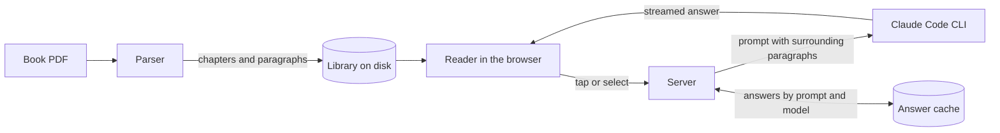

# DeepRead

**Read hard books in English without leaving the page.**

DeepRead turns a book PDF into a clean, continuous reading view and puts a patient tutor in the margin.
Tap a word and you get its meaning in your own language.
Select a passage and you get what it says, what is going on, and what it really means.

It runs entirely on your own machine and needs no API key.

## Why

Reading a difficult book in a second language usually goes like this.
You hit a sentence you do not understand.
You copy it, switch to a chat window, and ask for an explanation.
A word in the answer is hard too, so you ask for a translation.
By the time you come back, you have lost your place and your focus.

DeepRead keeps all of that inside the book.
The explanation appears beside the paragraph you are reading, and you keep going.

## What it does

| | |
| --- | --- |
| **Whole-book reading** | Add a PDF and read it start to finish as one continuous page. Chapters follow each other as you scroll, and your place is saved. |
| **Tap a word** | Its meaning in your language, a simple English meaning, and an example sentence. The meaning is chosen for the sentence you are in, so "minute sums of money" is "very small", not a unit of time. |
| **Explain a passage** | Select any text and choose **Explain**. You get it in simple words, in context (who is speaking, what just happened), its deeper meaning (the idea, psychology or theme behind it), and its hard words. |
| **Translate a passage** | **In Bangla** (or your language) gives a faithful, natural translation followed by a short explanation. |
| **Make it concrete** | **Example** restates the idea as an everyday situation. |
| **Chapter companion** | A short preview with the words to watch before a chapter, and a summary of the key ideas after it. |
| **Listen** | Reads the book aloud and highlights the sentence and the word being spoken. |
| **Your library** | Add, rename and remove books. Notes stay beside their paragraphs and survive a reload. |

Reading languages for explanations: Bangla (default), Hindi, Urdu, Arabic, Spanish, French, Indonesian and Turkish.

## Quick start

You need:

- [Node.js](https://nodejs.org) 24 or newer and [pnpm](https://pnpm.io)
- The [Claude Code](https://claude.com/claude-code) CLI, installed and logged in
- A recent Chrome, Edge or Safari

```bash
git clone https://github.com/mrx-arafat/DeepRead.git
cd DeepRead
pnpm install
pnpm dev
```

Open http://localhost:5173 and add a PDF.

DeepRead has no API key of its own.
Explanations are produced by running `claude` in headless mode with your existing login, so whatever plan you use for Claude Code is what answers your questions.

## How it works



### The parser

PDFs store positioned glyphs, not paragraphs, so the parser rebuilds the book:

- Chapters come from the PDF outline when there is one, and from heading detection when there is not.
- Running headers, footers and page numbers are removed.
- Lines are joined into paragraphs, hyphenated line breaks are healed, and paragraphs that continue across a page break are stitched back together.
- Scanned PDFs (pages that are images) are detected and rejected with a clear message instead of producing garbage.
- Parsing runs in a worker thread with a hard timeout, so a malformed PDF cannot hang the server.

Checked against the raw text layer of an 86 page novel, the parsed book kept 36,353 of 36,358 words (99.98%).

### The tutor

Every prompt lives in [`server/prompts.ts`](server/prompts.ts).
The model sees the paragraph you are on plus the paragraphs before and after it, so it explains what the sentence means at that point in the book rather than in general.

Two models are used, chosen by measuring them on real passages:

| Task | Model | Why |
| --- | --- | --- |
| Single word | Claude Haiku | Answers in about a second and picks the right sense. |
| Passages and chapters | Claude Sonnet | Haiku invented events and wrote broken Bangla on full passages. Sonnet is accurate and translates naturally, at the cost of a few seconds before the first word. |

Answers stream as they are written and are cached on disk, keyed by the prompt and the model, so asking again is instant and editing a prompt never serves a stale answer.

### The reader

The reading view is plain React and CSS.
Each paragraph is a single text node, and word and sentence highlights are painted with the CSS Custom Highlight API, so the book's DOM stays light even for long books.
Explanations sit in the margin beside their paragraph on wide screens and directly under it on narrow ones.

## Privacy

- Your PDFs, the parsed books and the answer cache stay in `data/` on your machine.
- The server listens on `127.0.0.1` only and rejects requests from other origins.
- The text you ask about is sent to Anthropic through your Claude Code login, the same as any Claude Code session.
- A fallback word translation uses an unofficial Google endpoint, and only if the AI answer fails.

## Project layout

| Path | What lives there |
| --- | --- |
| `shared/types.ts` | The contract between the server and the web app |
| `server/parser/` | PDF to chapters and paragraphs |
| `server/prompts.ts` | Every prompt sent to the model |
| `server/llm.ts` | Access to the Claude Code CLI: streaming, timeouts, concurrency |
| `server/library.ts` | Books on disk |
| `server/routes-*.ts` | HTTP routes |
| `src/` | The web app: library and reader |

## Scripts

| Command | Does |
| --- | --- |
| `pnpm dev` | Server on 8787 and web app on 5173, with reload |
| `pnpm build` then `pnpm start` | Production build, served by the server on 8787 |
| `pnpm test` | Unit and functional tests |
| `pnpm typecheck` | TypeScript check |

## Limits

- Scanned PDFs need OCR first. OCR is not built in yet.
- Figures, tables and images from the PDF are not shown in the reading view.
- Reading aloud uses the voices built into your browser and operating system.
- An explanation of a passage takes a few seconds to start, because accuracy was chosen over speed there.

## Acknowledgements

- [pdf.js](https://github.com/mozilla/pdf.js) reads the PDF text layer.
- [Read Frog](https://github.com/mengxi-ream/read-frog) inspired the tap-to-translate and select-to-explain interactions.
- The fonts are [Literata](https://github.com/googlefonts/literata), drawn for long reading on screens, [Atkinson Hyperlegible Next](https://www.brailleinstitute.org/freefont/), drawn so similar letters are hard to confuse, and [Noto Sans Bengali](https://fonts.google.com/noto/specimen/Noto+Sans+Bengali).
