<div align="center">

# DeepRead

**Read hard books in English without leaving the page.**

Tap a word for its meaning in your own language.
Select a passage and get it explained in simple words.
Listen to the book read aloud.
Everything runs on your own computer.

[](LICENSE)
[](https://nodejs.org)
[-1d3bb8)](#install-in-one-line)

[Install](#install-in-one-line) · [AI helpers](#ai-helpers) · [How to use it](#how-to-use-deepread) · [Troubleshooting](#troubleshooting) · [How it works](#how-it-works)

<table><tr><td>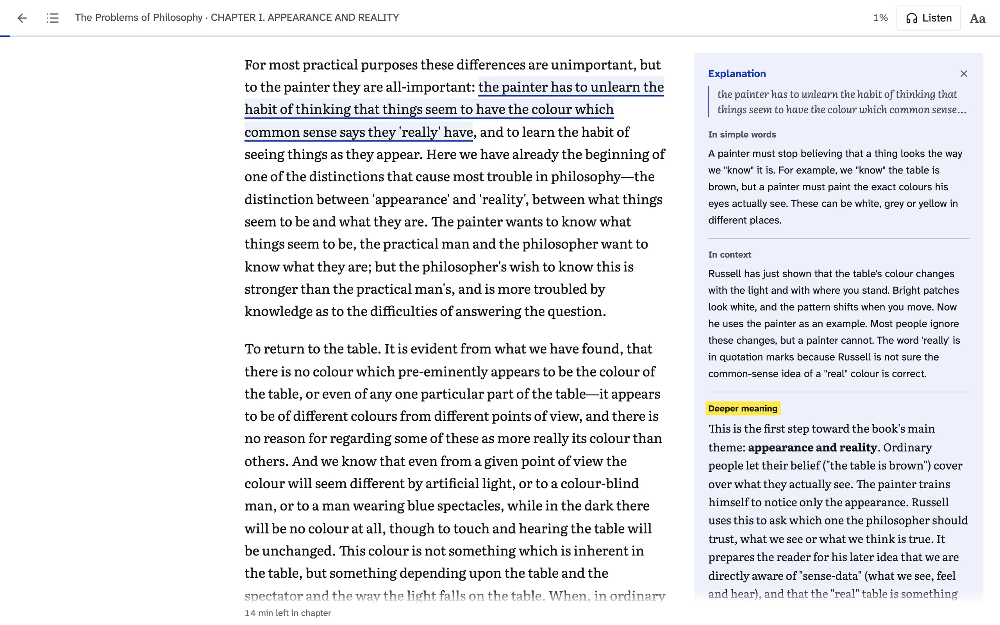</td></tr></table>

</div>

## Why

Reading a difficult book in a second language usually goes like this.
You hit a sentence you do not understand.
You copy it, switch to a chat window, and ask for an explanation.
A word in the answer is hard too, so you ask for a translation.
By the time you come back, you have lost your place and your focus.

DeepRead keeps all of that inside the book.
The explanation appears beside the paragraph you are reading, and you keep going.

## Install in one line

Open a terminal and paste this:

```bash
curl -fsSL https://raw.githubusercontent.com/mrx-arafat/DeepRead/main/scripts/install.sh | bash
```

That is the whole installation.
It takes about a minute and asks before it installs anything else.

<table>
<tr><td width="34%"><b>What it checks</b></td><td width="66%"><b>What it does about it</b></td></tr>
<tr><td>git</td><td>Tells you the one command to install it if it is missing.</td></tr>
<tr><td>Node.js 24 or newer</td><td>On a Mac with <a href="https://brew.sh">Homebrew</a> it offers to install it for you. Otherwise it points you to <a href="https://nodejs.org/en/download">nodejs.org</a>.</td></tr>
<tr><td>An AI helper</td><td>Looks for Claude Code or Codex. If neither is there, it lets you pick one to install, or none (the default): reading and listening work without one (see <a href="#ai-helpers">AI helpers</a>). Nothing is installed unless you pick it.</td></tr>
<tr><td>DeepRead itself</td><td>Downloads it to <code>~/DeepRead</code> (or updates it), installs its packages, builds it, and adds the <code>deepread</code> command.</td></tr>
</table>

### Start, stop, update

| To | Do this |
| --- | --- |
| Start DeepRead | Run `deepread`. It opens http://127.0.0.1:8787 in your browser. |
| Stop it | Press `Ctrl+C` in the terminal where it runs. |
| Get the latest version | Run `deepread update`, or paste the install command again. |
| See every option | Run `deepread help`. |

The first time, open a new terminal window before you type `deepread`, so your terminal knows the new command.

<details>
<summary><b>On Windows</b></summary>

DeepRead runs on Windows inside WSL, Microsoft's built-in Linux.

1. Open PowerShell as administrator and run `wsl --install`.
   Restart your computer when it asks.
2. Open **Ubuntu** from the Start menu and choose a user name and password.
3. In Ubuntu, install Node.js 24 by following the Linux steps on [nodejs.org/en/download](https://nodejs.org/en/download).
4. Still in Ubuntu, paste the install command above.
5. Run `deepread`.
   It opens DeepRead in your normal Windows browser.

</details>

<details>
<summary><b>Install somewhere else, or uninstall</b></summary>

To install into another folder, put `DEEPREAD_DIR` in front of the command:

```bash
curl -fsSL https://raw.githubusercontent.com/mrx-arafat/DeepRead/main/scripts/install.sh | DEEPREAD_DIR=~/Apps/DeepRead bash
```

To uninstall, delete the folder and the command:

```bash
rm -rf ~/DeepRead ~/.local/bin/deepread
```

This also deletes your books and notes, which live in `~/DeepRead/data`.
The installer may have added a line mentioning `.local/bin` to `~/.zshrc`, `~/.bashrc` or `~/.bash_profile`; you can delete it too.

</details>

## AI helpers

DeepRead has no API key and no account of its own.
It explains words and passages through an AI tool you already use, signed in with your own subscription.

| AI helper | Comes with | Install | Sign in once |
| --- | --- | --- | --- |
| **Claude Code** | Claude Pro or Max | `curl -fsSL https://claude.ai/install.sh \| bash` | run `claude` and follow the steps |
| **Codex** | ChatGPT Plus or Pro | `npm install -g @openai/codex` | run `codex` and choose **Sign in with ChatGPT** |

If you have both, open **Aa** in the reader and pick one under **AI helper**.
DeepRead remembers your choice.
If you install one later, it shows up there the next time you open the menu.

<table><tr><td>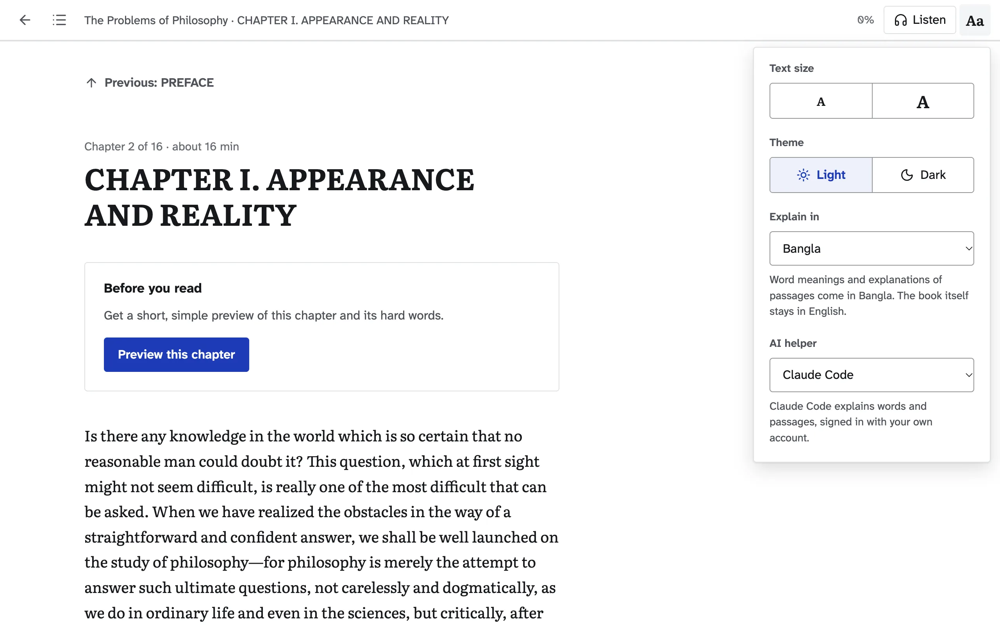</td></tr></table>

**With no AI helper at all**, you can still read, listen, change settings, and tap a word to see a quick translation in your language.
Only the explanations (the meaning, the example sentence and the passage notes) need an AI helper, and DeepRead tells you how to add one.

> [!NOTE]
> Antigravity's command-line tool is not supported.
> When asked a question from a script, it runs commands on your computer, even in its plan and sandbox modes, so text inside a book could make it do things you did not ask for.
> Claude Code and Codex are both run with their tools switched off.

## How to use DeepRead

### 1. Add a book

Click **Add a book (PDF)**, or drop a PDF onto the page.
DeepRead works with PDFs whose text you can select (most e-books and Project Gutenberg books).
Scanned books, where each page is a photo, need OCR first.

<table><tr><td>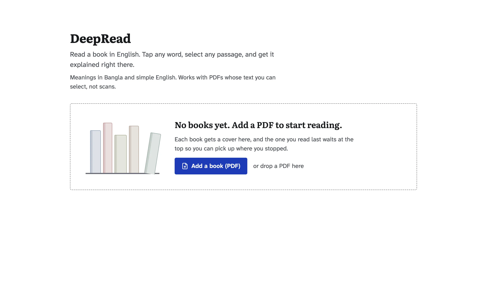</td></tr></table>

### 2. Your library

Every book shows where you stopped.
Click **Continue** to open it right there.
The pencil renames a book or adds its author, and the bin removes it.

<table><tr><td>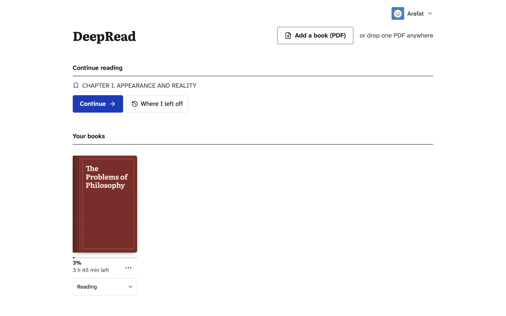</td></tr></table>

### 3. Read

The book reads as one long page.
It opens at the book itself, past the title page and contents, and the next chapter follows as you scroll.
Your place is saved as you go.

<table><tr><td>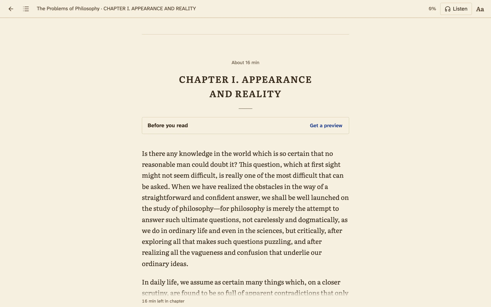</td></tr></table>

### 4. Tap a word

Tap or click any word.
A card shows its meaning in your language, a simple English meaning, and an everyday example.
The meaning is chosen for the sentence you are in, so "minute sums of money" is "very small", not a unit of time.
Terms like "sense-data" and "a priori" are looked up whole.
The speaker button says the word aloud.

<table><tr><td>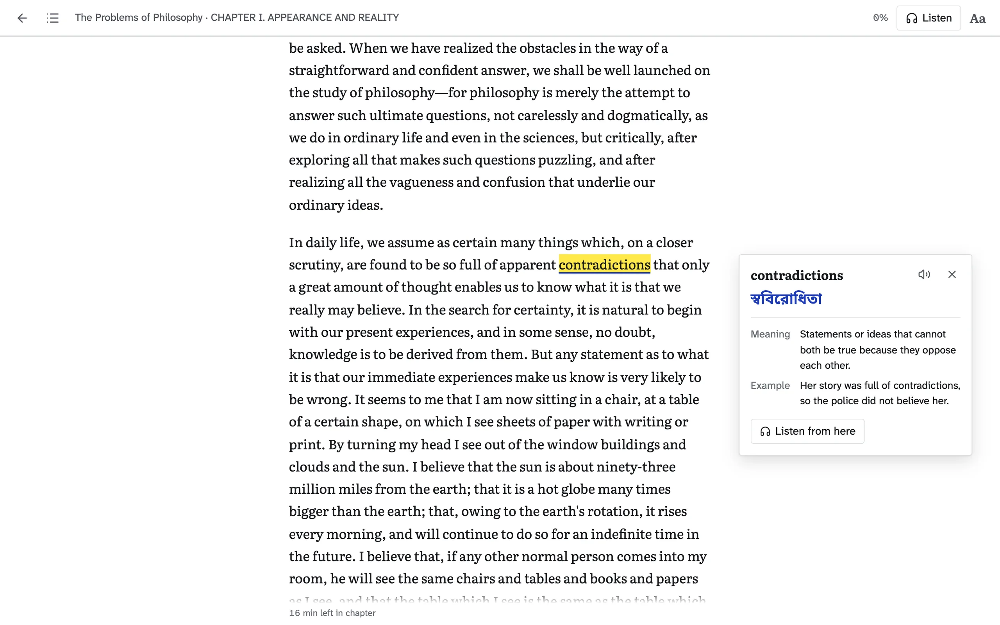</td></tr></table>

On a wide screen the card sits in the margin, level with the word, so it never covers the text.
On a narrow screen it opens above or below, clear of the sentence you are reading.

### 5. Explain a passage

Select a sentence or a paragraph, then choose what you want:

| Button | You get |
| --- | --- |
| **Explain** | The passage in simple words, in context (who is speaking, what just happened), its deeper meaning, and its hard words |
| **Example** | The idea retold as an everyday situation |
| **In Bangla** (named after your language) | A faithful translation into your language, then a short explanation |
| The headphones | Reading aloud from that passage |

<table><tr><td>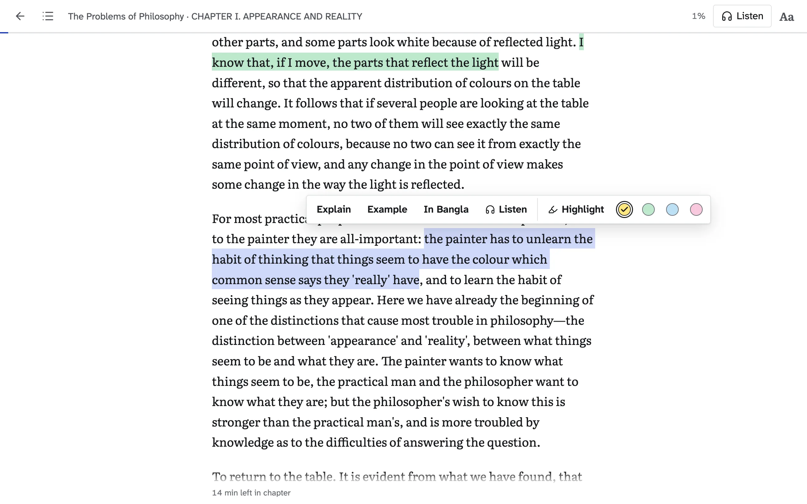</td></tr></table>

The answer is pinned beside the paragraph like a teacher's note, and it stays there when you come back to the book.

<table><tr><td></td></tr></table>

### 6. Before and after a chapter

Each chapter starts with **Preview this chapter**, a short preview with the words to watch.
It ends with **Summarize this chapter**, the key ideas in simple words.

### 7. Listen

Press **Listen** in the top bar.
DeepRead reads from the line you are looking at, chapter titles included, and marks the sentence in green and the word being spoken in a stronger green.
The player has previous and next sentence, pause, speed (0.8x to 1.5x) and stop.
If you scroll away, the page stays where you put it, and the player offers a way back to the voice.

<table><tr><td>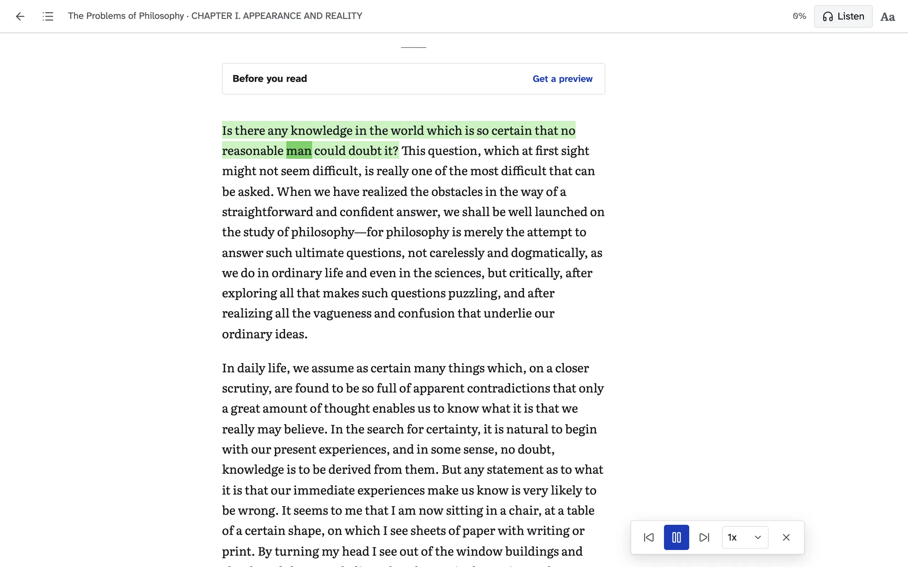</td></tr></table>

Listening uses the voices built into your browser and computer, so it works without an AI helper.

### 8. Jump to a chapter

The list button at the top left shows every chapter with its reading time.
Front and back matter (contents, notes, index, licences) are listed but do not count toward your progress.

<table><tr><td>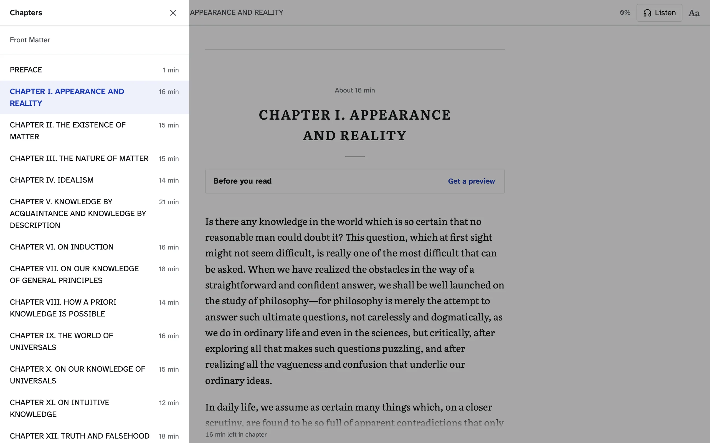</td></tr></table>

### 9. Make it yours

Open **Aa** at the top right to set the text size, a light or dark page, the language explanations come in, and your AI helper (pictured in [AI helpers](#ai-helpers)).
Explanation languages: Bangla (the default), Hindi, Urdu, Arabic, Spanish, French, Indonesian and Turkish.

DeepRead also fits a phone screen, here in the dark theme:

<table><tr><td>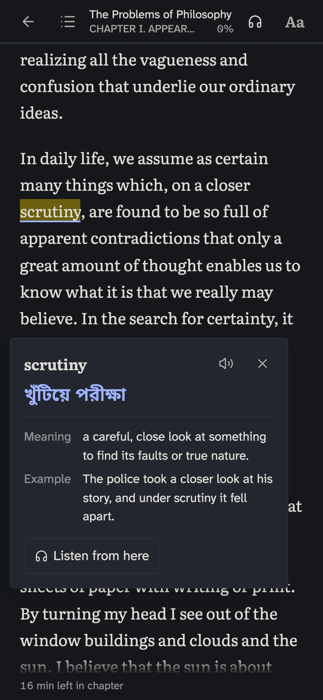</td></tr></table>

### 10. By keyboard

| Key | Does |
| --- | --- |
| `Tab` | Moves into the book text |
| `↑` `↓` | Moves between paragraphs |
| `←` `→` | Moves word by word |
| `Enter` | Looks up the word, or opens the Explain bar for the selection |
| `Shift` + `←` `→` | Selects a passage word by word |
| `Esc` | Closes the word card or the Explain bar and returns you to your place; with nothing open, stops listening |

## Troubleshooting

<details>
<summary><b><code>deepread: command not found</code></b></summary>

Open a new terminal window: the installer added the command to your PATH, and only new windows see it.
You can also start DeepRead directly with `node ~/DeepRead/scripts/deepread.mjs`.

</details>

<details>
<summary><b>"DeepRead could not start" or port 8787 is in use</b></summary>

Another program uses that port.
Start DeepRead on another one: `DEEPREAD_PORT=8790 deepread`.

</details>

<details>
<summary><b>Explanations say "not signed in"</b></summary>

Open a terminal and sign in to your AI helper once: run `claude` for Claude Code, or `codex` for Codex.
Then press **Try again** on the card.

</details>

<details>
<summary><b>Explanations say "DeepRead needs an AI helper"</b></summary>

Neither Claude Code nor Codex was found.
Install one as shown in [AI helpers](#ai-helpers), sign in, then open **Aa** in the reader.

</details>

<details>
<summary><b>Adding a book says it is a scan</b></summary>

The pages are pictures, not text.
Find a version of the book whose text you can select, or run it through OCR first (for example with `ocrmypdf`), then add the new PDF.

</details>

<details>
<summary><b>Where are my books and notes?</b></summary>

In `~/DeepRead/data`.
Copy that folder to back them up.
`deepread update` never touches it.

</details>

## Read on your phone

With a developer setup (see [For developers](#for-developers)), run:

```bash
pnpm phone
```

This runs DeepRead and shares it through a [Cloudflare quick tunnel](https://developers.cloudflare.com/cloudflare-one/connections/connect-networks/do-more-with-tunnels/trycloudflare/) (needs `cloudflared`, on macOS `brew install cloudflared`).
It prints a link to open on your phone.
The link carries a secret key, kept in `data/remote-key`, that unlocks DeepRead on that device.
Without the key, the tunnel answers nothing but the empty page shell.
Anyone who has the link can use DeepRead and your AI helper's usage, so do not share it.

## How it works

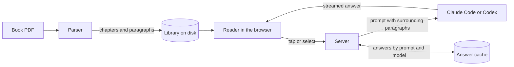

### The parser

PDFs store positioned glyphs, not paragraphs, so the parser rebuilds the book:

- Chapters come from the PDF outline when there is one, and from heading detection when there is not.
- Front matter (title page, copyright, contents) and back matter (notes, index, appendices, Project Gutenberg's header and licence) are marked as such, so the reader can skip them.
- Running headers, footers and page numbers are removed.
- Lines are joined into paragraphs, hyphenated line breaks are healed, and paragraphs that continue across a page break are stitched back together.
- Scanned PDFs (pages that are images) are detected and rejected with a clear message instead of producing garbage.
- Parsing runs in a worker thread with a hard timeout, so a malformed PDF cannot hang the server.

Checked against the raw text layer of an 86 page novel, the parsed book kept 36,353 of 36,358 words (99.98%).
Every upload runs the same kind of check, and the book carries a warning naming the pages if text was lost.
A 527 page book parses in about a second.

### The tutor

Every prompt lives in [`server/prompts.ts`](server/prompts.ts).
The model sees the paragraph you are on plus the paragraphs before and after it, so it explains what the sentence means at that point in the book rather than in general.

The AI helper is run headless, one process per answer, in an empty folder, with its tools switched off ([`server/llm.ts`](server/llm.ts)).
With Claude Code every answer comes from Claude Sonnet, chosen by measuring models on real passages and words.
Claude Haiku is about twice as fast, but it invented events and wrote broken Bangla on full passages, and on single words it gave the term of the wrong field, such as the physics word for "induction" in a chapter on logic.
A tapped word is answered at Claude Code's "high" effort level, whatever yours is set to, so an everyday word shows its Bangla line in about a second and only a term of the book's subject waits while Sonnet thinks.
With Codex, answers come from Codex's default model at low reasoning effort; its own coding instructions are replaced by DeepRead's.
Codex still reads your personal `~/.codex/AGENTS.md`, because it has no switch to leave that out.

Answers stream as they are written and are cached on disk, keyed by the prompt and the model, so asking again is instant and editing a prompt never serves a stale answer.

### The reader

The reading view is plain React and CSS.
Each paragraph is a single text node, and word and sentence highlights are painted with the CSS Custom Highlight API, so the book's DOM stays light even for long books.
Explanations sit in the margin beside their paragraph on wide screens and directly under it on narrow ones.

## Privacy

- Your PDFs, the parsed books and the answer cache stay in `data/` on your computer.
- The server listens on `127.0.0.1` only and rejects requests from other websites.
  With `pnpm phone`, remote devices are refused until they open the link with the secret key.
- The text you ask about goes to Anthropic (Claude Code) or OpenAI (Codex) through your own sign-in, the same as any session you start yourself.
- A fallback word translation uses an unofficial Google endpoint, and only if the AI answer fails or there is no AI helper.

## For developers

```bash
git clone https://github.com/mrx-arafat/DeepRead.git
cd DeepRead
pnpm install
pnpm dev
```

Open http://localhost:5173.
You need [Node.js](https://nodejs.org) 24 or newer and [pnpm](https://pnpm.io).

| Command | Does |
| --- | --- |
| `pnpm dev` | Server on 8787 and web app on 5173, with reload |
| `pnpm phone` | The same, plus a locked tunnel link for reading on your phone |
| `pnpm build` then `pnpm start` | Production build, served by the server on 8787 (what `deepread` runs) |
| `pnpm test` | Unit and functional tests |
| `pnpm typecheck` | TypeScript check |

| Path | What lives there |
| --- | --- |
| `shared/types.ts` | The contract between the server and the web app |
| `server/parser/` | PDF to chapters and paragraphs |
| `server/prompts.ts` | Every prompt sent to the model |
| `server/ai.ts` | Which AI helper answers: detection and the reader's choice |
| `server/llm.ts` | Running Claude Code or Codex: streaming, timeouts, concurrency |
| `server/library.ts` | Books on disk |
| `server/routes-*.ts` | HTTP routes |
| `src/` | The web app: library and reader |
| `scripts/install.sh`, `scripts/deepread.mjs` | The one-line installer and the `deepread` command |
| `e2e/` | End-to-end browser tests of reader journeys |

## Limits

- Scanned PDFs need OCR first. OCR is not built in yet.
- Figures, tables and images from the PDF are not shown in the reading view.
- Reading aloud uses the voices built into your browser and operating system.
- An answer takes a few seconds to start, even for a single word, because accuracy was chosen over speed.

## License

[MIT](LICENSE)

## Acknowledgements

- [pdf.js](https://github.com/mozilla/pdf.js) reads the PDF text layer.
- [Read Frog](https://github.com/mengxi-ream/read-frog) inspired the tap-to-translate and select-to-explain interactions.
- The fonts are [Literata](https://github.com/googlefonts/literata), drawn for long reading on screens, [Atkinson Hyperlegible Next](https://www.brailleinstitute.org/freefont/), drawn so similar letters are hard to confuse, and [Noto Sans Bengali](https://fonts.google.com/noto/specimen/Noto+Sans+Bengali).
- The sample book in the screenshots is Bertrand Russell's *The Problems of Philosophy*, from Project Gutenberg.
